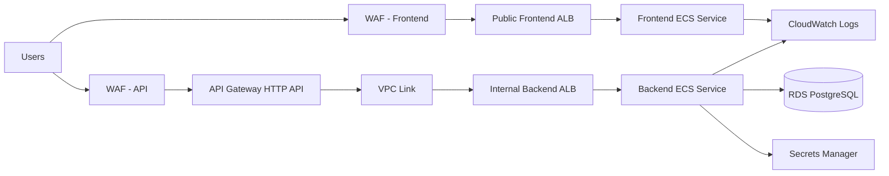
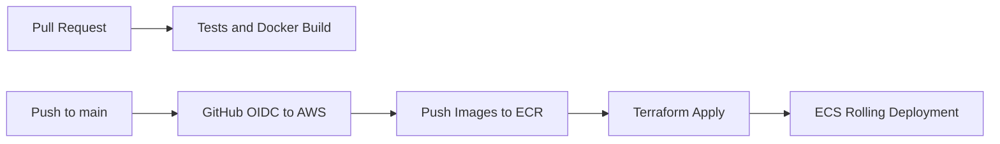

# AWS ECS Architecture and Delivery Status

This project deploys the FastAPI full-stack template as a production-oriented
three-layer AWS application in `ap-southeast-2`.

## Current Status

Completed:

- Local repository is connected to GitHub:
  `https://github.com/toannd021104/AWS-3layer-app.git`.
- Default branch is `main`.
- GitHub Actions are updated to run on `main`.
- CI test workflows are configured to create `.env` from `.env.example` on
  GitHub runners.
- Latest CI checks on `origin/main` passed:
  - `Test Backend`
  - `Test Docker Compose`
  - `Playwright Tests`
  - `Zizmor`
  - `Conflict detector`
  - `Smokeshow`
- AWS ECS deploy workflow is present but intentionally skipped until AWS deploy
  variables are enabled.
- Compose staging deploy workflow is present but intentionally skipped until a
  self-hosted staging runner and deploy variables are enabled.

Pending:

- Configure GitHub repository variables for AWS deployment.
- Configure the GitHub OIDC deploy role in AWS.
- Decide whether to use Terraform-created networking or pass existing regional
  VPC subnet IDs.
- Run the first AWS ECS deployment.
- Add DNS/ACM values if using a real domain.

## Layers

- Presentation: React frontend container served by Nginx on ECS Fargate.
- Application: FastAPI backend container on ECS Fargate.
- Data: Amazon RDS for PostgreSQL in private subnets.

## AWS Services

- VPC with public and private subnets across two regional Availability Zones.
- Internet Gateway for public ingress and NAT Gateways for private egress.
- Public Application Load Balancer for frontend traffic.
- Internal Application Load Balancer for private backend traffic.
- Amazon API Gateway HTTP API with VPC Link for API ingress.
- AWS WAF managed rule groups on public frontend and API entry points.
- Amazon ECS Fargate for backend and frontend containers.
- Amazon ECR repositories for backend and frontend images.
- Amazon RDS PostgreSQL with encryption enabled.
- AWS Secrets Manager for application and database secrets.
- AWS CloudWatch Logs for container logs.
- IAM roles with least-privilege task execution access.
- Optional Route 53 and ACM support for business domains.

The subnet selection must use only main regional Availability Zones in
`ap-southeast-2`, not Local Zones. NAT Gateway, ALB, API Gateway VPC Link, RDS,
and ECS Fargate all assume regional subnet placement.

## Traffic Flow

The frontend load balancer routes browser traffic to the Nginx container. API
requests go through API Gateway and a private VPC Link to an internal backend
load balancer. ECS tasks run in private subnets. The database security group
accepts PostgreSQL traffic only from the backend service security group.

## Edge and API Controls

- Frontend ALB has a regional WAF web ACL with AWS managed common, bad input,
  known bad IP, and SQL injection rules.
- API Gateway has its own regional WAF web ACL and throttling.
- API Gateway is the public API boundary; the backend ALB is internal only.
- Optional ACM certificates enable HTTPS listeners and business domains.

## CI/CD Flow

GitHub Actions uses OpenID Connect to assume an AWS role without storing static
AWS access keys. The deployment workflow builds immutable images tagged with the
Git commit SHA, pushes them to ECR, applies Terraform, and lets ECS perform a
rolling deployment.

The AWS deploy workflow is gated by repository variables so normal pushes do not
fail before AWS credentials are configured:

- `ENABLE_AWS_ECS_DEPLOY=true`
- `AWS_ROLE_ARN=<github-deploy-role-arn>`
- `AWS_REGION=ap-southeast-2`
- `TF_PROJECT_NAME=<project-name>`
- `TF_ENVIRONMENT=dev` or another supported environment

When these variables are missing, the workflow is skipped by design.

## First AWS Deployment Plan

1. Bootstrap Terraform state and AWS credentials.
2. Apply the ECS Terraform stack in `infra/aws/ecs`.
3. Create ECR repositories for backend and frontend images.
4. Build and push backend image.
5. Build and push a bootstrap frontend image.
6. Apply infrastructure using the bootstrap frontend.
7. Read the API Gateway invoke URL from Terraform output.
8. Rebuild the frontend with the real API URL.
9. Push the final frontend image.
10. Apply the final ECS service update.

## Security and Operations Notes

- Backend ECS tasks, frontend ECS tasks, and RDS are private.
- Public ingress is limited to the frontend ALB and API Gateway.
- API Gateway reaches the backend through VPC Link and an internal ALB.
- RDS accepts PostgreSQL traffic only from the backend ECS security group.
- Secrets are stored in AWS Secrets Manager and injected into ECS task
  definitions.
- IAM role names should include region and workspace context because IAM role
  names are account-global.
- For production, enable deletion protection and stronger backup settings for
  RDS.

## Why ECS Fargate

ECS Fargate is the default target for this repository because it gives a strong
business baseline with less platform overhead than EKS:

- no worker node management;
- simple scaling and health checks;
- direct integration with ALB, ECR, IAM, CloudWatch, and Secrets Manager;
- lower operational complexity for a standard three-layer web app.

EKS is a good next step when the organization already standardizes on Kubernetes
or needs Kubernetes-specific controllers, service mesh, custom operators, or
multi-cloud portability.
