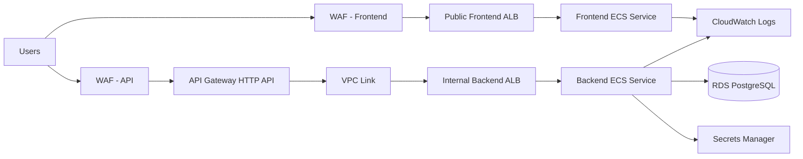
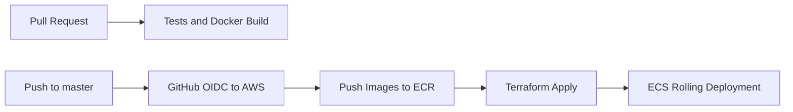

# AWS ECS Architecture

This project deploys the FastAPI full-stack template as a production-oriented
three-layer AWS application.

## Layers

- Presentation: React frontend container served by Nginx on ECS Fargate.
- Application: FastAPI backend container on ECS Fargate.
- Data: Amazon RDS for PostgreSQL in private subnets.

## AWS Services

- VPC with public and private subnets across two Availability Zones.
- Internet Gateway for public ingress and NAT Gateways for private egress.
- Public Application Load Balancer for frontend traffic.
- Internal Application Load Balancer for private backend traffic.
- Amazon API Gateway HTTP API with VPC Link for API ingress.
- AWS WAF managed rule groups on public frontend and API entry points.
- Amazon ECS Fargate for backend and frontend containers.
- Amazon ECR repositories for backend and frontend images.
- Amazon RDS PostgreSQL with encryption enabled.
- AWS Secrets Manager for application and database secrets.
- AWS CloudWatch Logs for container logs.
- IAM roles with least-privilege task execution access.
- Optional Route 53 and ACM support for business domains.

## Traffic Flow

The frontend load balancer routes browser traffic to the Nginx container. API
requests go through API Gateway and a private VPC Link to an internal backend
load balancer. ECS tasks run in private subnets. The database security group
accepts PostgreSQL traffic only from the backend service security group.

## Edge and API Controls

- Frontend ALB has a regional WAF web ACL with AWS managed common, bad input,
  known bad IP, and SQL injection rules.
- API Gateway has its own regional WAF web ACL and throttling.
- API Gateway is the public API boundary; the backend ALB is internal only.
- Optional ACM certificates enable HTTPS listeners and business domains.

## CI/CD Flow

GitHub Actions uses OpenID Connect to assume an AWS role without storing static
AWS access keys. The deployment workflow builds immutable images tagged with the
Git commit SHA, pushes them to ECR, applies Terraform, and lets ECS perform a
rolling deployment.

## Why ECS Fargate

ECS Fargate is the default target for this repository because it gives a strong
business baseline with less platform overhead than EKS:

- no worker node management;
- simple scaling and health checks;
- direct integration with ALB, ECR, IAM, CloudWatch, and Secrets Manager;
- lower operational complexity for a standard three-layer web app.

EKS is a good next step when the organization already standardizes on Kubernetes
or needs Kubernetes-specific controllers, service mesh, custom operators, or
multi-cloud portability.
